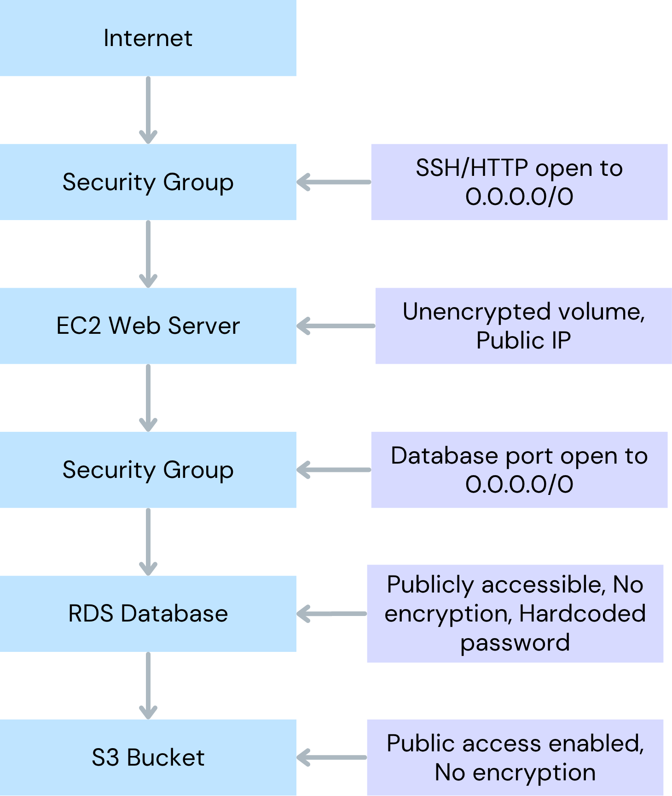

# Understanding the Terraform Infrastructure

Before we start scanning for security vulnerabilities, let's understand the infrastructure we're working with. This tutorial uses a sample AWS infrastructure that represents a typical web application architecture.

## Infrastructure Overview

Our Terraform project creates the following AWS resources:

### 1. **VPC and Networking**
- A Virtual Private Cloud (VPC) with CIDR block 10.0.0.0/16
- One public subnet (10.0.1.0/24) for web-facing resources
- Two private subnets (10.0.2.0/24 and 10.0.3.0/24) for the database

### 2. **S3 Storage Bucket**
- An S3 bucket named `company-data-bucket` for storing application data
- This bucket is intended to store sensitive company information and user uploads

### 3. **EC2 Web Server**
- A t2.micro EC2 instance running Amazon Linux 2
- Serves as the application web server
- Has a 20GB root volume for the operating system and application files

### 4. **RDS PostgreSQL Database**
- A PostgreSQL database (version 14.7) on a db.t3.micro instance
- Stores application data, user information, and transaction records
- 20GB of allocated storage

### 5. **Security Groups**
- Web security group controlling access to the EC2 instance
- Database security group controlling access to the RDS instance

## Viewing the Terraform Files

The environment has been set up with three main Terraform files that you can explore in the editor:
- `main.tf` - Contains all of the resource definitions listed above
- `variables.tf` - Defines the input variables
- `outputs.tf` - Defines the outputs after infrastructure is created

## What Makes This Infrastructure Vulnerable?

While this infrastructure might look functional, it contains multiple security misconfigurations that cause serious security risks. Here are a few of the common but serious security misconfigurations included in this project:

- **Public Exposure**: Resources that should be private are accessible from the internet
- **Missing Encryption**: Sensitive data stored without encryption
- **Weak Access Controls**: Overly permissive security rules
- **Poor Credential Management**: Hardcoded passwords and secrets
- **Lack of Logging**: No audit trails for security events

In the next step, we'll use Checkov to automatically identify these vulnerabilities!

## Architecture Diagram
This setup is a common configuration pattern that contains many misconfigurations at each step. 

