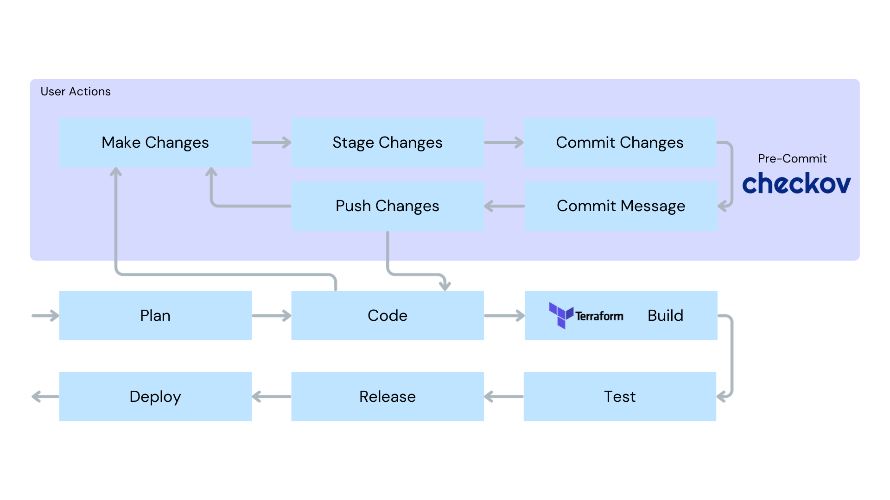

# Integrating with CI/CD pipeline

Integrating Checkov in the CI/CD pipeline is essential to ensure that IaC configurations are secure from vulnerabilities before deployment. By integrating Checkov into the pipeline, it will help to catch vulnerabilities early and prevent insecure resources from reaching production. 

In this tutorial, you will be implementing Checkov as a pre-commit hook. This ensures that your IaC is scanned before you commit to version control so that only scanned, secure code will be added to the repository. 



## Adding Checkov as a Pre-Commit Hook

First, you need to install pre-commit:

```
pipx install pre-commit
```{{exec}}

Now, create a file called `.pre-commit-config.yaml` and copy and paste the Checkov pre-commit hook code listed below:

```
touch .pre-commit-config.yaml
```{{exec}}

Open `.pre-commit-config.yaml` in your favourite terminal text editor, i.e., vim or nano, and add the following:

```
repos:
  - repo: https://github.com/bridgecrewio/checkov.git
    rev: '3.2.471'
    hooks:
      - id: checkov
```{{copy}}

Let's make this a git repository to track our changes! You will need to configure your identity to do this. Replace the sections in the brackets to your own information. 

```
git init
git config user.email "<YOUR EMAIL>"
git config user.name "<YOUR NAME>"
```{{copy}}

Your project should now be created and initialized. You can install your newly created hook by running: 

```
pre-commit install
```{{exec}}

Now, let's add and commit these new changes and watch as Checkov runs automatically with every commit! 

```
git add .
git commit -m "added checkov to terraform project and fixed vulnerabilities"
```{{exec}}

By adding Checkov as a pre-commit hook, you've ensured that any code you commit to the repository will be scanned and pass Checkov's checks. You can be confident that your pushed infrastructure is more secure!

Congratulations! You should have passed all Checkov checks and see this result from the pre-commit: 
`Checkov..............Passed`
